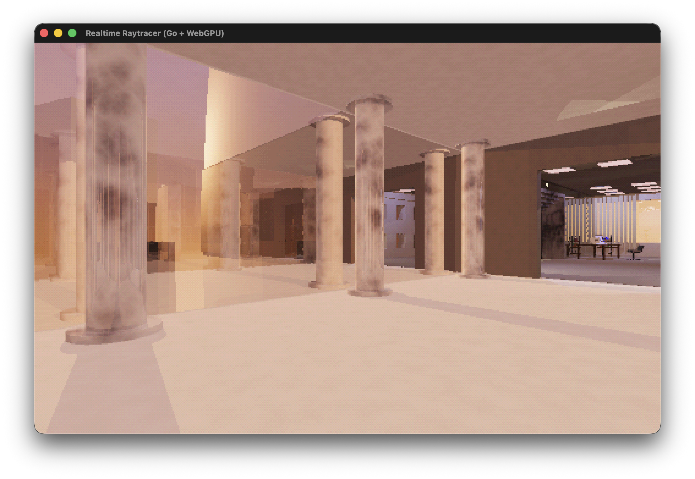

# Frontier Reality



A small realtime 3D engine built around ray tracing. It draws the world with a WebGPU shader that traces rays from the camera, lights surfaces with point lights and shadows, and supports reflections and glass. The look is deliberately retro — simple shapes, low resolution, procedural textures — but the lighting is physically motivated enough that plain geometry reads as a place rather than a diagram.

**This project is work in progress and experimental.** APIs, scene formats, and performance will change. Expect rough edges.

## Running

```bash
go run .                                    # built-in default scene
go run . -scene scenes/indoor-outdoor.toml  # load a scene file
```

Requires a machine with WebGPU (macOS with recent Metal, or a browser-class GPU stack). Player movement uses [Jolt](https://github.com/jrouwe/JoltPhysics) for collision.

Headless previews (orbit screenshots):

```bash
go run ./cmd/preview -scene scenes/preview/island.toml -o tmp/island
```

## Scene authoring in TOML

There is no level editor. Worlds are written as [TOML](https://toml.io) files and loaded at startup. You can edit a scene while the app runs and reload it from disk.

A scene lists analytical primitives — spheres, boxes, cylinders, cones, tori, planes — plus lights, sky, terrain, and water. Materials are named (`diffuse`, `glass`, `metal`, …) and textures are procedural (brick, wood, checker, …), generated on the CPU and sampled in the shader.

**Composing scenes.** Base scenes can be extended (`extends = "outdoors.toml"`). Reusable chunks live in separate files and are merged with `[[include]]`. Objects can nest includes and accept parameters:

```toml
[[include]]
file = "objects/pine-tree.toml"
transform = [10.0, 0.0, 5.0, 0.0, 0.0, 0.0]
props = { height = 8.0 }
```

**Parameterized objects.** Object files can declare `[props]` (inputs), `[const]` (derived values), and use simple expressions in field values (`pos_y = '-half'`). Comment directives provide loops and conditionals (`# for i in range(steps)` … `# endfor`, `# if texture` … `# endif`). Helpers like `hash01` and `book_thickness` are available for repetitive geometry. See `SCENES.README.md` for the full reference. JSON schemas in `schemas/` give IDE validation.

Box holes (`[[box.hole]]`) cut rectangular openings for windows and doors without hand-modelling separate pieces.

## How rendering works

Each pixel shoots a ray from the camera. On a hit, the shader picks a material path:

- **Diffuse** surfaces get direct lighting (point lights, inverse-square falloff, hard shadow rays) plus optional fuzzy reflections.
- **Metal and mirror** spawn a reflected ray, tinted by surface color.
- **Glass** spawns reflection and refraction rays weighted by Fresnel. Thick panes (two faces) and stacked glass multiply the number of rays quickly — this is the main cost in glass-heavy views.

The ray tree is walked with a fixed stack (not recursion), capped at a few bounces. Sky is procedural. Ambient occlusion is pre-baked into a 3D volume on the CPU and sampled in the shader, so AO does not add per-pixel ray cost at runtime.

Audio uses a separate CPU probe that traces rays through the same scene geometry for room reverb and occlusion.

## Optimizations worth knowing about

**Shader specialization.** The trace shader is one large program. Before loading a scene, a Go pass rewrites compile-time flags (`FEAT_TERRAIN`, `FEAT_WATER`, per-primitive kinds, …) to `false` for features the scene does not use. The compiler drops the dead branches. Same image, less register pressure — roughly 10–15% faster on scenes that omit terrain or unused primitive types.

**Shadow culling in reflections.** Shadow rays are expensive. When a reflection path has already lost most of its brightness, the shader skips the shadow test and treats the light as unshadowed. Primary views are barely affected; mirror-heavy scenes see a large drop in shadow-ray count.

**Thin glass.** Single-surface glass (`thin = true` on a box or plane) treats the pane as one interface instead of tracing entry and exit through a solid slab. For window glass this is much cheaper than thick glass and looks close enough at a distance.

**Thin glass ghost.** On primary rays, thin glass can spawn a cheap second reflection offset along the pane — a stand-in for seeing both faces of a double-glazed window without paying for two full glass bounces. Toggle with the in-game ghost key (see HUD).

**Two-pane windows.** `two_pane = true` marks authored double glazing; it uses thick-glass paths when you need both panes to matter.

**Pipelined frames.** The CPU submits the next frame while the GPU finishes the previous one, so interaction does not stall on render completion.

## Scenes

| Path | Notes |
|------|-------|
| `scenes/default.toml` | Embedded fallback |
| `scenes/indoor-outdoor.toml` | Interior + exterior |
| `scenes/manhattan_city_block.toml` | Glass towers, stress test |
| `scenes/office-sunset/` | Submodule — private repo [metamorphosis-3d](https://github.com/arnold-graf/metamorphosis-3d). Clone with `git submodule update --init`. |

## Docs and tools

- `SCENES.README.md` — scene and object TOML reference
- `docs/ray-tracing.md` — renderer walkthrough
- `docs/shader-specialization.md` — specialization and profiling notes
- `docs/reflection-optimization.md` — shadow culling and bounce-path costs
- `cmd/preview` — headless orbit renders
- `cmd/gpuprof` — GPU timing (match app defaults: 512×320, depth 4, AA on)

## License

GPL-3.0. See `LICENSE`.
