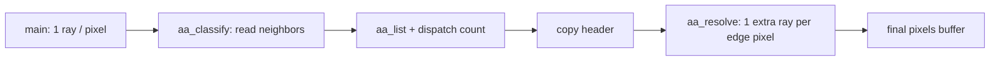

# Adaptive anti-aliasing

**Status:** shipped.  
**Audience:** developers who want to understand what the AA pass does and how it
hooks into the ray tracer — without assuming game-engine or GPU background.

For performance numbers and tuning history, see
[Adaptive AA in megakernel-optimization.md](megakernel-optimization.md#adaptive-aa-classify-then-resolve-indirectly).

---

## What it is (and what it isn't)

With one ray through the center of each pixel, edges look jagged: object
silhouettes, shadow boundaries, and sharp brightness changes all show as
stair-steps.

**Adaptive AA** smooths those edges by tracing **one extra camera ray** on
pixels that need it, then averaging that ray with the center sample (50/50).

This is **not** a screen-space blur (no FXAA/SMAA-style filter over finished
pixels). The extra sample goes through the same path tracer as the primary ray
— same BVH, materials, bounces, glass, shadows. Only the ray origin within the
pixel changes slightly (a sub-pixel offset).

When AA is off (`params.adaptive_aa == 0`), `main` traces one ray per pixel and
writes the final color. No classify or resolve passes run.

---

## Three steps per frame

Each frame with AA on runs three compute shader entry points, in order:

| Step | Shader | What it does |
|---|---|---|
| 1 | `main` | Trace one ray per pixel (center of pixel). Write the image **and** scratch data for step 2. |
| 2 | `aa_classify` | Look at each pixel's neighbors. **No new rays.** Build a list of pixels that need an extra sample. |
| 3 | `aa_resolve` | For each pixel in that list, trace **one more ray** at a chosen sub-pixel offset. Blend with the center color and rewrite the pixel. |

Steps 1 and 2 run in the same GPU compute pass (so classify always sees what
`main` wrote). Step 3 runs in a **separate** pass because WebGPU does not allow
the same buffer to be both written as a task list and read as an indirect
dispatch size in one pass — the host copies the dispatch header between them.

Host wiring lives in `internal/webgpu/device.go` (`submitTrace`). Shader logic
is in `internal/webgpu/shaders/modules/trace.wesl` (`main`, `aa_classify`,
`aa_resolve`).

---

## What gets stored after step 1

For every pixel, `main` writes two scratch buffers (in addition to the tonemapped
output pixel):

- **`hdr_pixels`** — linear HDR color (`.xyz`) and a **display luminance**
  (`.w`) after tonemap. Classify compares neighbors using this scalar instead of
  re-tonemapping four times per pixel.
- **`aa_hits`** — a packed fingerprint of the **primary** hit only: which
  primitive and instance the center ray struck first (or “miss”).

Non-edge pixels are already fully shaded after step 1. Steps 2–3 only touch
pixels where an extra ray would visibly help.

---

## How step 2 decides “this pixel needs work”

Each pixel looks at its four neighbors (left, right, up, down). An extra ray is
scheduled if **either** kind of edge is detected:

### Geometry edges (silhouettes)

Neighbors hit **different surfaces** (different packed fingerprint), **and** the
brightness gap between them is large enough to matter on screen
(`AA_GEOM_MIN_LEVELS`, currently 3 on an 8-bit luminance scale).

Fingerprint-only detection would fire on every seam between adjacent boxes in
authored geometry (server racks, wall panels) even when both sides are evenly
lit. The luminance gate filters out boundaries that would not change after
quantization.

### Shading edges (shadows, contact darkening)

Neighbors hit the **same** surface, but brightness **curves** sharply — e.g. a
hard shadow terminator. The test is the second difference of luminance:
`|left + right − 2×center|` (and the same on the vertical axis), compared to
`AA_SHADE_MIN_CURVE` (currently 10).

A plain brightness gap between neighbors would fire on smooth point-light
falloff everywhere; curvature is near zero on a linear ramp and spikes where a
shadow creates a visible staircase.

### Sub-pixel tap direction

If an edge is found on an axis, the extra ray is **not** shot through the pixel
center again. The tap is offset to `0.25` or `0.75` along that axis, toward the
brighter neighbor — so the supersample actually pulls the color toward the edge.
If no edge is found, that axis uses `0.5` (center); if both axes are center, the
pixel is skipped entirely.

Tasks are packed into one `u32` per edge pixel (coordinates + tap indices) and
appended to **`aa_list`**. The expensive resolve pass only runs for entries in
that list, not for the full screen.

---

## What step 3 does

For each task, `aa_resolve`:

1. Reads the center HDR color from `hdr_pixels`.
2. Calls `ray_color` again with the same camera, but `pixel_ray_dir` uses the
   packed sub-pixel tap.
3. Averages center and extra: `(center + extra) × 0.5`.
4. Tonemaps, dithers, quantizes, and writes `pixels` (same path as `main`).

So AA is **integrated with the ray tracer**, not a post-process on the 8-bit
framebuffer. Tap rays must match center rays in quality; cheaper tap shading was
tried and reverted because any mismatch shows up as bright fringes exactly on
edges (especially through glass). See
[Rejected: cheaper AA tap rays](megakernel-optimization.md#rejected-cheaper-aa-tap-rays).

---

## Why split classify and resolve?

Originally, edge detection and the extra ray ran in one pass over the full
screen. Edge pixels are sparse and scattered along silhouettes. On the GPU,
threads are launched in fixed-size batches; if **any** thread in a batch needs an
extra ray, the whole batch pays for that cost while most threads sit idle.

**Classify** is cheap (read a few neighbors, no tracing). **Resolve** is
expensive (full `ray_color`). Building a compact list first means the expensive
pass only launches work for pixels that actually need it, with much less wasted
effort.

That split is what made widening AA to shadow edges affordable (~0.8 ms extra
for the curvature test at the shipped threshold).

---

## Configuration

| Knob | Where | Effect |
|---|---|---|
| Adaptive AA on/off | App / `render.View.AdaptiveAA`, `params.adaptive_aa` | Enables the three-step path vs single `main` pass |
| `AA_GEOM_MIN_LEVELS` | `trace.wesl` | Minimum luminance gap for silhouette edges |
| `AA_SHADE_MIN_CURVE` | `trace.wesl` | Minimum curvature for same-surface shadow edges |
| `AA_RESOLVE_WG` | `types.wesl` / `device.go` | Thread batch size for the resolve pass (64) |

`cmd/gpuprof` defaults to adaptive AA on to match the app (`-aa` flag).

---

## Related

- [ray-tracing.md](ray-tracing.md) — how a single pixel is traced (`ray_color`,
  materials, bounces).
- [megakernel-optimization.md](megakernel-optimization.md) — performance story,
  shadow-edge AA tuning table, rejected cheaper taps.
- [bounce-kernel.md](bounce-kernel.md) — planned future work; bounce sheen may
  run before classify so edge detection sees the final composite.
