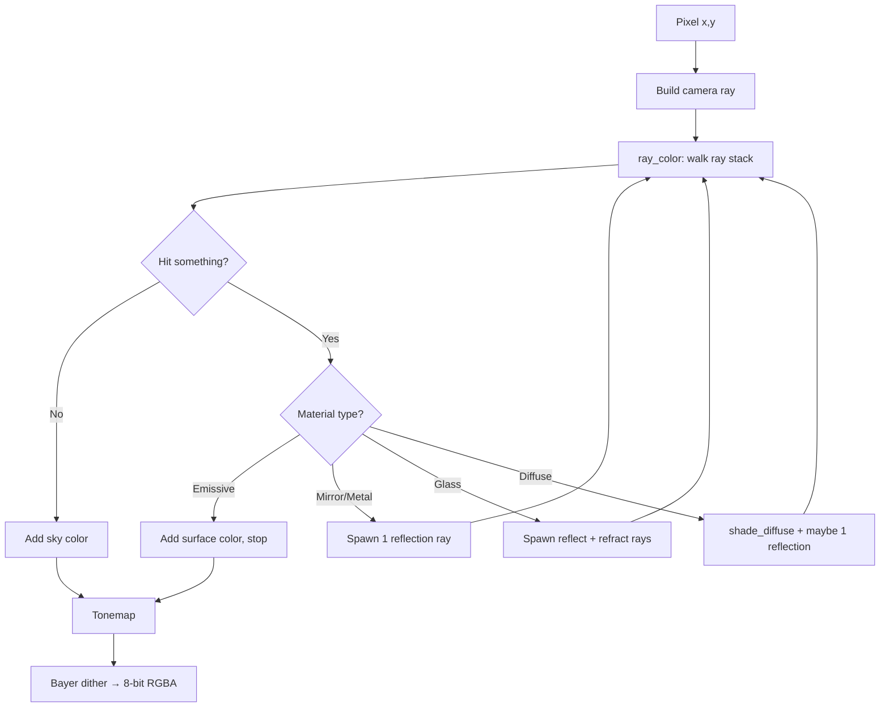

Here’s a simplified walkthrough of both systems, framed for someone who knows software but not game engines.

---

## Part 1: The renderer (WebGPU “path tracer”)

### Big picture

Each frame, a **compute shader** runs one thread per pixel. That thread shoots a ray from the camera through the pixel into the scene, walks a small **ray tree**, accumulates color, tonemaps, and writes RGBA8.

There is **no CPU ray tracing at runtime** anymore. The CPU only:

- loads the scene
- builds a BVH for geometry queries (audio + AO baking)
- uploads scene buffers to the GPU
- reads the pixel buffer back for Ebiten to display

Think of it as: **one primary ray per pixel, plus a bounded number of secondary rays for reflections/refractions**.

---

### Step-by-step: how a pixel gets its color



**1. Build the camera ray**

From pixel `(x, y)`, compute a direction in world space from the camera basis (forward/right/up) and FOV. Origin = camera position.

**2. Trace with a work stack (`ray_color`)**

Instead of recursion, the shader uses a stack of up to **16 ray segments**. Each segment carries:

- ray origin + direction
- **throughput weight** `tw` (how much this path contributes)
- **depth** (bounce count)

**3. On a hit, branch by material**

| Material | What happens |
|---|---|
| **Miss** | Add procedural **sky** (+ optional sun/moon disc) × throughput, done |
| **Emissive** (fire, lamps) | Add albedo × throughput, stop |
| **Mirror / metal** | Spawn **one reflected ray**, tinted by albedo × 0.96, continue |
| **Glass** | Spawn up to **two** rays: Fresnel-weighted reflection + refraction (see-through). Both can run in parallel on the stack |
| **Diffuse / checker / water floor** | Compute **direct lighting** (below). If the surface has a `refl` term and reflections are enabled, add the lit portion now and spawn one fuzzy reflection ray |

**4. Direct lighting (`shade_diffuse`) — this is where most pixels get their “lit” look**

For diffuse surfaces, color is **not** from more bounces. It’s analytic:

```
lit = albedo × ambient
    + sum over point lights (N·L × attenuation × shadow test × light color × albedo)
    + campfire sub-lights (same, with flicker)
lit *= baked_AO_sample   // if AO toggle on
```

- **Ambient** is a flat constant (`0.04 × albedo`) — a baseline so nothing is pitch black.
- **Point lights** use inverse-square falloff + optional radius window.
- **Shadows** = one **shadow ray per light** toward the light. If anything blocks before the light, that light is skipped. Hard shadows, not soft penumbra.
- **AO** = sample a **pre-baked 3D volume** (not live rays per pixel).

So a typical wall pixel is: flat ambient + campfire/light contribution − shadows − crevice darkening from AO.

**5. Tonemap + output**

HDR color → simple tonemap → 8-bit with **ordered Bayer dithering** to reduce banding.

---

### How many bounces?

**Max path depth = 3** (depth 0, 1, 2).

Reflections/refractions only spawn when `depth < 2` and the mirror toggle is on — so depths **0 and 1** can spawn secondary rays; at depth **2** everything falls through to diffuse shading.

In practice:

| Path type | Typical depth |
|---|---|
| Primary camera ray | 0 |
| One bounce (mirror, glass, semi-glossy wall) | 1 |
| Two bounces (mirror in mirror, glass then reflection, etc.) | 2 |
| Glass can **fork** (reflect + refract), so the stack can hold up to **7 live segments** (1 + 2 + 4) |

This is **not** Monte Carlo path tracing (no random sampling per pixel, no unbounded convergence). It’s a **deterministic, capped ray tree** — closer to a real-time ray tracer from the Quake-era / WebGL demo lineage than to offline path tracing.

**Separate from bounces:** shadow rays and AO are extra geometry queries, but they don’t extend the reflection tree.

---

### Where AO fits (visual, not audio)

On scene load, the CPU **`Probe.BakeAO()`** fills a 3D grid over the scene bounds:

- **32 fixed directions** per cell (Fibonacci sphere)
- each direction: ray cast → “how blocked is this hemisphere direction?”
- stored as a **6-face ambient cube** per cell (Valve-style)
- GPU trilinearly samples it and blends faces by surface normal

So AO is **ray-traced once at load time**, then **looked up** during shading. Toggle `[3]` in-game.

---

## Part 2: The audio engine (“audio ray tracing”)

Important distinction: **audio does not synthesize sound by bouncing rays around a room in real time**. It uses **cheap geometry probes** to **drive parameters** of a conventional audio pipeline.

```mermaid
flowchart LR
    subgraph CPU each ~100ms
        R[Reverb probe: 9 horizontal rays + 1 up]
        O[Per-ambient: 1 occlusion ray]
    end
    subgraph Audio thread 44.1kHz
        F[Footsteps: synthesized one-shots]
        A[Ambients: looping crickets etc.]
        M[Mixer: sum + Freeverb reverb]
        S[Stereo out]
    end
    R --> M
    O --> A
    F --> M
    A --> M
    M --> S
```

### Architecture

1. **`Engine`** — owns Ebiten audio context + streaming **`Mixer`**
2. **`Mixer.Read()`** — called by the audio thread; sums all voices, runs reverb, outputs stereo float32 PCM
3. **`Probe`** — same BVH as AO, but for **“distance to nearest wall along this ray”** (terrain excluded on purpose)

---

### Three uses of ray casts

#### 1. Room reverb (`updateReverb`, ~10×/sec)

From the player’s head position:

- **1 ray up** → ceiling distance → blend indoor vs outdoor
- **8 horizontal rays** (cardinal + diagonals) → did we hit a wall within 25 m?

From that:

- **Enclosure** = fraction of rays that hit → longer/shorter reverb tail
- **Per-ear wetness** = wall hits weighted by direction relative to player’s “right” vector → walking along a wall sounds louder in that ear
- **Feedback / damping** = average hit distance → “room size” and brightness of tail

These feed a **Freeverb-style algorithmic reverb** (comb + allpass delay lines). The rays don’t produce impulse responses — they just **knob-turn** `feedback`, `damp`, `wetL`, `wetR`.

Values are **eased over time** so doorways fade instead of popping.

#### 2. Ambient occlusion for sound (`ambientOcclusion`)

For each `[[sound]]` emitter (e.g. crickets in trees):

- Ray from **listener → emitter**
- If a wall is hit well before the source: muffling ≈ `(hitDist / totalDist)³`
- Combined with distance falloff + stereo pan
- Occlusion is **smoothed** over ~0.4 s

So crickets outside go nearly silent when you’re inside, even if you’re “within radius.”

#### 3. Footsteps — no ray tracing

Footsteps are **procedurally synthesized** buffers (grass/wood/stone/snow), triggered by walked distance. The only scene query is **`StepMaterialAt`** underfoot (which surface material), not acoustic rays.

---

### What you actually hear each audio frame

```
dry_L = dry_R = sum(one-shot footsteps)
amb_L, amb_R = sum(spatial looping ambients, already panned + occluded)
rev_L, rev_R = Freeverb(dry)   // reverb only on footsteps, not ambients

out_L = dry + wetL × rev_L + amb_L
out_R = dry + wetR × rev_R + amb_R
```

Footsteps stay **centered**; reverb tail is **stereo-panned** from the wall probes; ambients are **fully spatial** and bypass reverb.

---

## Side-by-side cheat sheet

| | **Visual renderer** | **Audio “ray tracing”** |
|---|---|---|
| **Where** | GPU compute shader, every pixel, every frame | CPU `Probe`, ~10 Hz for reverb, every frame for ambients |
| **Rays per query** | 1 primary + up to ~7 secondaries; +1 shadow ray per light at each diffuse hit | 9–10 for reverb; 1 per ambient source |
| **Bounces** | Up to **2** reflection/refraction bounces (depth 0→1→2) | **Single** intersection: nearest wall distance |
| **Output** | Pixel RGB | Reverb knobs, occlusion gain, pan |
| **Precomputed** | AO volume (32 dirs × grid cells) | None (reverb params are live) |
| **Terrain** | Full intersection + normal | **Ignored** for acoustic probes (ground ≠ wall) |

---

## Mental model

**Rendering:** “For each pixel, shoot a ray, shade the first diffuse hit with lights + shadows + baked AO, optionally follow a few reflection/refraction bounces, add sky on miss.”

**Audio:** “Occasionally ask the scene geometry ‘how enclosed am I?’ and ‘is there a wall between me and that cricket?’ — then dial a classic reverb and volume knobs accordingly.”

It’s ray tracing used as a **geometry oracle**, not as a wave simulator. No path-traced impulse responses, no material-dependent absorption per bounce — just enough spatial awareness to make indoors feel indoors and outdoor sounds feel muffled through walls.
