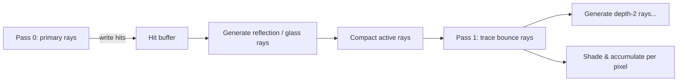

# Reflection & Shadow Optimization Options

**Status:** **B1 shipped** in `trace.wgsl` (2026-07-06). B2/B3 tried and reverted (no measurable wall-clock win).  
**Audience:** anyone deciding what to build next  
**Constraint:** perceptual parity preferred; strict byte-parity no longer required for bounce-path shadow culls (see [B1 — shipped](#b1--shipped-accepted)).

> ⚠️ **Timings below predate the 2026-08-15 `gpuprof` fix and understate the app.** Every GPU figure in this document was measured at 400×250 with bounce depth 2 and adaptive AA off, because `cmd/gpuprof` did not set `MaxBounceDepth` and fell through to the shader default. The app renders 512×320 at depth 4 with AA on — on the office scene that was the difference between 7.8 ms and 29.3 ms. The *conclusions* here still hold (reflections dominate; BVH quality is not the lever, since a balanced tree later measured 23% slower); the *numbers* do not. Re-measure before comparing. See [shader-specialization.md](shader-specialization.md).

---

## B1 — shipped (accepted)

Throughput-based shadow skipping is **live**. `shade_diffuse` and `add_point_light_raw` take the active ray’s throughput `tw` and apply two culls before expensive `shadowed()` calls:

1. **Brightness cull:** `tw_peak(tw) × att × N·L × color < LIGHT_CULL_EPS` → skip light entirely.
2. **Shadow skip:** `tw_peak(tw) × unshadowed_peak < SHADOW_SKIP_EPS` (1/256) → add as unshadowed, no shadow ray.

`SHADOW_SKIP_EPS` is `0.0009765625` (1/1024) in `internal/webgpu/shaders/trace.wgsl`. Campfire core shadows use the same threshold.

### Measured (server room, 400×250, mirrors on)

| Metric | Before | After B1 |
|---|---|---|
| GPU shade time | ~3.7 ms | ~2.8 ms (~25% faster) |
| Shadow rays / frame | ~55k | ~1.7k (~97% fewer) |
| `gpuprof -dump` byte diff | — | ~2,400 pixels differ (~2.4% of image) |

### Acceptance note (2026-07-06)

`gpuprof -dump` reports thousands of differing pixels, but in practice the image is **perceptually identical** — differences are sub-LSB shifts concentrated in mirror/reflection shading where throughput is low. Frame rate and laptop power consumption improve substantially with mirrors on.

**We accept this tradeoff for now.** Revisit if:

- a scene shows visible shadow/lighting errors in reflections,
- outdoor primary-path lighting regresses (B1 is tw-scaled; at `tw ≈ 1` primary behavior is nearly unchanged),
- we need stricter parity for a release / regression gate.

### What’s left for B1?

**Nothing required.** The optimization is complete. Optional follow-ups only:

- Tune `SHADOW_SKIP_EPS` or `LIGHT_CULL_EPS` if a scene looks wrong.
- Restrict aggressive culls to `tw_peak(tw) < 1` if primary-path byte drift ever matters.
- Re-profile villa / Manhattan with mirrors after thermal settle.

---

## Executive summary

The server room is expensive when mirrors are on because **each pixel traces more rays that go in different directions**. On Apple Silicon WebGPU, threads in a 64-thread workgroup execute together; when neighbor pixels shoot reflection rays at different angles, the GPU stalls waiting for the slowest thread. That is **divergence**, and it is the main WebGPU-specific pain point for reflections.

We measured two things that narrow the problem:

| Observation | What it means |
|---|---|
| Mirrors off ≈ halves GPU power / ~2× faster shade time | Reflections are the dominant cost, not BVH quality |
| BVH ~7.7 node visits per ray, ~2.1 prim tests per ray | The tree is already good; shaving traversal is unlikely to help much |
| Shadows off barely moves server-room frame time | Primary-path shadows are cheap here; bounce-path work is the bigger lever |

There are **two families of fixes**, at very different cost:

### Option A — Wavefront / streaming reflections (big rewrite)

**Idea:** Stop doing everything in one shader pass. Instead: trace primary rays → collect reflection rays into a buffer → trace those rays in a second pass (repeat per bounce depth). Rays that hit the same kind of surface stay more coherent, so the GPU wastes less time on divergence.

**Best for:** scenes with lots of glass/mirrors, deeper bounces, or much larger geometry where megakernel limits show up clearly.

**Cost:** Large architectural change (new buffers, compaction, multiple dispatches, tricky glass forking). Weeks of work, not days.

### Option B — Cheaper shadows on reflection paths (targeted tweaks)

**Idea:** Keep the current megakernel, but spend less work when a **bounce** ray (depth > 0) hits a diffuse surface and runs `shade_diffuse`. Today that path fires the same full shadow-ray loop as a primary ray — one BVH traversal per light per bounce hit.

**Best for:** the server room right now — mirrors are on, geometry is small (~100 prims), and we want wins without rewriting the renderer.

**Cost:** Low to medium. Several sub-options are fidelity-preserving (skip work that cannot change the final pixel). Others trade a controlled amount of quality for speed and need A/B pixel tests.

### Recommendation (today)

| Priority | Approach | Why |
|---|---|---|
| **1** | Cheaper bounce shadows (Option B, safe tiers first) | Matches our measured bottleneck, small diff, keeps one-dispatch simplicity |
| **2** | Keep 60 fps cap as the power lever | Already works; no code risk |
| **3** | Wavefront (Option A) | Revisit only if we add heavy triangle meshes, more bounce depth, or Option B is exhausted |

Use the HUD counters (`bvh X steps Y tests/ray`, `paths/px`, `shadows/px`) and `gpuprof -profile` to validate any change: if `steps/ray` does not move, a BVH tweak will not help; if `shadows/px` or `paths/px` drops, we are on the right track.

---

## Current architecture (baseline)

Today the renderer is a **single compute dispatch megakernel** (`trace.wgsl`):

```
main()  →  ray_color()  →  work stack of RaySeg (max 16)
                ↓
         nearest_hit() per segment  (BVH + planes + terrain + water)
                ↓
         branch on material:
           mirror/metal  → push 1 reflection ray (no lighting on mirror itself)
           glass         → push up to 2 rays (reflect + refract)
           diffuse       → shade_diffuse() then maybe push 1 reflection ray
```

Key files:

| Piece | Location |
|---|---|
| Ray stack & bounce logic | `internal/webgpu/shaders/trace.wgsl` — `ray_color`, `RaySeg` |
| Shadow tests | `shadowed()` — blocker BVH, blocker planes, terrain march |
| Direct lighting | `shade_diffuse()` — ambient + point lights + campfires + AO |
| BVH build (CPU, offline) | `internal/webgpu/bvh.go` |
| Profiling / HUD | `gpuprof -profile`, in-game HUD line `bvh … steps … tests/ray` |

Workgroup size is **8×8 = 64** threads — already in the sweet spot for divergent traversal on WebGPU.

### What happens on a mirror pixel (server room)

1. **Primary ray** hits mirror → spawns **reflection ray** (depth 1). No shadows on the mirror surface.
2. Reflection ray hits a wall/server/desk (diffuse) → **`shade_diffuse` runs with full shadows** (one shadow ray per light).
3. If that surface is semi-reflective, another bounce may be pushed.

So mirror cost is not just “one extra BVH trace” — it is **extra BVH traces plus full direct lighting with shadow rays on every diffuse hit along the reflection path**. That is why power drops so sharply when mirrors are toggled off.

### Measurements (server room, 400×250, mirrors on)

From `gpuprof -profile` on `scenes/office-sunset/server-room-1.toml`:

| Metric | Value |
|---|---|
| GPU shade time | ~2–6 ms (machine / thermal dependent) |
| Path segments | ~1.0 / pixel |
| Shadow rays | ~0.5 / pixel (primary + bounce combined) |
| BVH steps | ~7.7 / ray |
| Prim tests | ~2.1 / ray |
| Shadow occlusion | ~100% (rays hit blockers quickly) |

Shadow rays are already exiting early when blocked; the cost is **launching** them (BVH entry, stack setup, divergence) on bounce paths that primary rays would not need.

---

## Option A: Wavefront / streaming for reflections

### Problem it solves

In a megakernel, **pixel A** might reflect toward the ceiling while **pixel B** reflects toward the floor. Both threads are in the same 8×8 tile, so the GPU executes both paths serially — classic **wavefront divergence**.

Wavefront path tracing fixes this by **separating ray stages by bounce depth** so each dispatch processes a homogeneous batch of rays.

### How it works (conceptual)



**Pass 0 — Primary trace**

- One thread per pixel.
- Trace camera ray, record hit (position, normal, material, throughput).
- Shade diffuse hits **or** enqueue secondary rays into a global `RayQueue`.

**Between passes — Generate & compact**

- For each hit that spawns a reflection/refraction, append a `Ray` record to a buffer.
- **Stream compaction:** remove dead / zero-throughput entries so the next dispatch only launches threads for live rays.
- Optional: **sort** rays by Morton code of origin or direction bucket — improves memory coherence (more complexity).

**Pass 1..N — Bounce trace**

- Dispatch `ceil(active_rays / 64)` workgroups.
- Each thread traces one bounce ray, records hit, enqueues next depth or shades into an accumulation buffer.

**Accumulation**

- Per-pixel `vec3` buffer additive-blended each pass (weighted by throughput).

### Glass complication

Glass forks into **two** children (reflect + refract). In a megakernel we use a small stack (`MAX_SEGS = 16`). In wavefront:

- Each glass hit produces **two** output rays → queue grows faster than mirror-only scenes.
- Need either a **fixed fan-out slot** (2× queue space per glass hit) or a **small per-ray stack** retained only for glass (hybrid).

This is the main reason wavefront is harder here than in a mirror-only or triangle-mesh engine.

### WebGPU-specific design notes

| Topic | Guidance |
|---|---|
| Workgroup size | Keep 64 (8×8); matches current shader |
| Ray queue | `storage` buffer, struct `{ origin, dir, throughput, pixel_idx, depth, flags }` — aim for 32–48 bytes/ray |
| Compaction | Second compute pass: prefix sum (`workgroup` scan) or atomic counter + scatter; no CPU readback per frame |
| Barriers | `queue.submit` between passes is the synchronization — acceptable for 2–3 bounces, still cheaper than CPU stall |
| Subgroups | Do not rely on them; support is inconsistent across browsers |
| Stack | Per-thread fixed `array<u32, 64>` for BVH traversal stays; only the **ray tree** moves to global queues |

### Pros & cons

| Pros | Cons |
|---|---|
| Best known fix for bounce divergence on GPUs | Large rewrite of `trace.wgsl` + host dispatch loop |
| Scales better if geometry / bounce depth grows | Glass forking, campfires, emissive, terrain need careful porting |
| Easier to profile per pass | More VRAM bandwidth (ray buffers read/write each pass) |
| Industry-standard approach | Must re-verify pixel parity across all scenes |

### Effort estimate

| Phase | Scope |
|---|---|
| **Prototype** | Primary pass + one reflection bounce, mirrors only, no glass — prove fps win on server room |
| **Production** | Glass fork, depth cap, accumulation, compaction, all materials — multi-week |
| **Polish** | Sorting, pipelined submits with existing frame pipelining |

### When to pull the trigger

- `paths/px` and GPU time scale badly when adding mirrors/glass to new scenes.
- Geometry grows to thousands of primitives / triangle meshes where megakernel + divergence compound.
- Option B (below) is exhausted but mirrors are still the bottleneck.

---

## Option B: Cheaper shadows on mirror / reflection paths

### Problem it solves

Mirrors do not cast shadows on themselves, but **everything seen in the reflection is shaded like a primary surface**. A bounce hit on a diffuse wall runs the full `shade_diffuse` → `add_point_light` → `shadowed` chain. In the server room that means redundant BVH work for lighting that is already dimmed by `tw * alb * 0.96` (mirror tint) and often visually subtle.

This targets **shader work and divergence** without changing how reflection rays are traced.

### Sub-options (safest first)

#### B1. Throughput-based shadow skip — **shipped**

**Rule:** Before calling `shadowed()`, skip if the light’s contribution cannot change the final 8-bit pixel:

```
if (tw_peak(tw) * att * ndl * max_light_rgb * albedo) < SHADOW_SKIP_EPS:
    add as unshadowed (no shadow ray)
```

Also scales the existing brightness cull by `tw_peak(tw)`.

| Risk | Accepted — perceptually identical in server room; ~2.4% pixels differ in byte compare |
|---|---|
| Payoff | **Large** on mirror-heavy views (~25% GPU, ~97% fewer shadow rays) |
| Verify | `gpuprof -profile`, `powermetrics`, eyeball mirrors |

#### B2. Depth-tiered shadow quality — **not shipped** (reverted)

Measured: ~28% fewer terrain march steps on villa, **no wall-clock GPU win**; server room unchanged (no terrain). Kept here as reference if we revisit bounce-path terrain skipping.

#### B3. Pass `depth` into `shade_diffuse` — **not shipped** (reverted)

B1 uses `tw` from the ray segment instead; explicit `depth` tiering was not needed.

#### B4. Shadow-ray batching within a tile (medium complexity)

For bounce hits, neighbor threads often test the same lights toward similar blocker geometry. A **workgroup-shared light list** or cached “sun/key light blocked?” bit per tile can short-circuit duplicate work.

| Risk | Medium — tile-sized shared memory, sync barriers |
|---|---|
| Payoff | Medium in mirror-heavy rooms with few lights |
| Portable | Yes, no subgroup extensions required |

#### B5. Reuse primary visibility (advanced)

If a reflection ray hits the **same surface point** as the primary ray would (common for floor reflections), reuse the primary shadow result. Requires hit-point / light-direction hashing and careful invalidation.

| Risk | High — easy to get wrong, likely visible differences |
|---|---|
| Payoff | High when it works |
| Recommend | Defer unless profiling shows duplicate tests dominate |

### What *not* to do for “same look”

- Randomly dropping shadow rays on bounce paths (noise / bias).
- Screen-space or temporal reuse (changes appearance frame-to-frame).
- Replacing bounce shading with a blurred SSR buffer.

### Verification gates (every change)

1. `go test ./internal/webgpu/` — parity tests (`TestReflectionParityMatchesCPU`, etc.).
2. `go run ./cmd/gpuprof -scene scenes/office-sunset/server-room-1.toml -profile` — compare GPU ms, `shadows/px`, `paths/px`.
3. `go run ./cmd/gpuprof -scene scenes/office-sunset/server-room-1.toml -dump before.rgba` vs `after.rgba` — byte diff.
4. Outdoor regression: `scenes/outdoors-night-villa.toml` — must not regress terrain shadows on primary paths.
5. `powermetrics` spot-check if optimizing for laptop thermals.

### Suggested implementation order (updated)

```
✅ B1 throughput skip (shipped)
✗ B2 blockers-only bounce shadows (reverted — no FPS win)
✗ B3 depth wiring (reverted — superseded by tw)
→ next lever if needed: Option A wavefront, or B4/B5 in this doc
```

---

## Comparison matrix

| | Wavefront (A) | Cheaper bounce shadows (B) |
|---|---|---|
| **Fixes divergence** | Yes — main win | Partially — fewer shadow rays on bounce paths |
| **Implementation size** | Large | Small–medium |
| **Same look (default)** | Yes, if careful | Yes for B1/B2-blockers-only; tiered modes need testing |
| **Glass support** | Hard | Unaffected (uses existing stack) |
| **Fits current “one dispatch” ethos** | No | Yes |
| **Best scene** | Manhattan glass towers, deep bounces | Server room mirrors |

---

## Related docs & prior art

| Doc | Notes |
|---|---|
| `docs/ray-tracing.md` | How the current megakernel works |
| `plans/glass-gpu.optimization.md` | Glass-specific megakernel options; explicitly deferred wavefront for v1 |
| `plans/bvh-acceleration.md` | BVH build — not the current bottleneck per HUD metrics |
| Jacco Bikker — [BVH Quality: Beyond SBVH](https://jacco.ompf2.com/2025/05/20/bvh-quality-beyond-sbvh/) | Tree quality; low ROI for ~100-prim server room |

---

## Glossary

| Term | Meaning |
|---|---|
| **Megakernel** | One shader does trace + shade + bounces in a single dispatch |
| **Wavefront** | One dispatch per bounce depth (or per stage); rays processed in batches |
| **Divergence** | Threads in a group take different control-flow paths → idle lanes |
| **Throughput (`tw`)** | How much a ray path contributes to the final pixel color |
| **Depth** | Bounce count from the camera (0 = primary) |
| **RRS-style metric** | `bvh steps/ray` and `prim tests/ray` on the HUD — lower = better tree |
