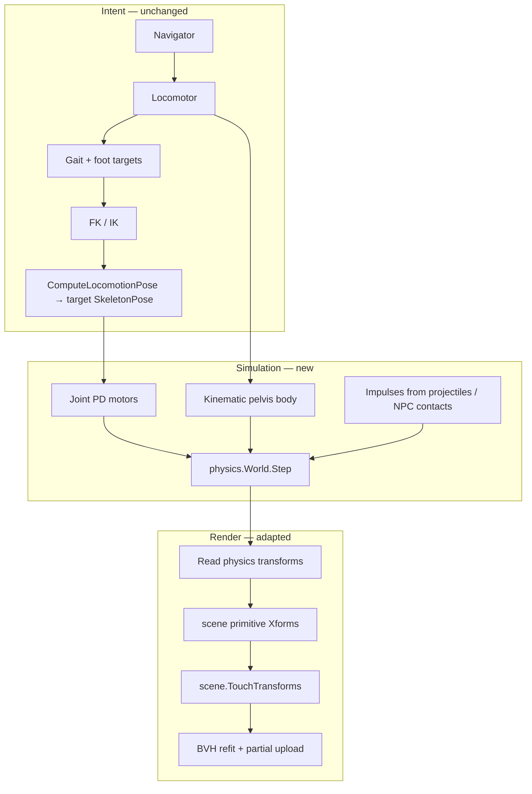
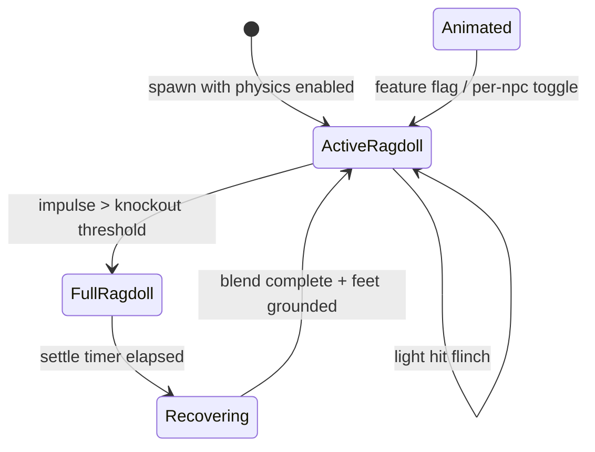

---

name: NPC Active Ragdoll
overview: "Kinematic-root active ragdoll for NPCs: authored locomotion (gait, IK, nav) drives joint motor targets; physics limbs realize motion, handle contacts, and react to projectiles and NPC bumps. Player stays kinematic. Phased rollout: humanoid first, spider later."
todos:

- id: physics-core
  content: Add internal/physics package — world, bodies, capsule colliders, revolute joints, PD motors, impulse API (Go-native v0)
  status: pending
- id: rig-physics-map
  content: Map Rig bones → physics bodies/joints; extend YAML with optional physics block (mass, friction, motor stiffness)
  status: pending
- id: agent-modes
  content: npc.Agent simulation modes (Animated, ActiveRagdoll, FullRagdoll, Recovering) and state transitions
  status: pending
- id: kinematic-root
  content: Drive pelvis body kinematically from Locomotor.HipPos + heading each frame
  status: pending
- id: motor-targets
  content: ComputeLocomotionPose → motor target angles/positions; physics step → readback transforms to scene primitives
  status: pending
- id: collision-layers
  content: Layer masks — static world, NPC limbs, NPC root, player capsule, projectiles; keep nav on static queries
  status: pending
- id: hit-response
  content: ApplyImpulse on projectile/NPC contact; torque caps; brief root dynamic on heavy hits
  status: pending
- id: projectile-system
  content: Minimal projectile spawner + ray/shape cast hit test against NPC limb layers
  status: pending
- id: npc-bump
  content: Limb–limb and root–limb contacts between NPCs without breaking patrol
  status: pending
- id: recover-blend
  content: Recovering mode — blend physics pose → authored idle, re-ground pelvis, re-enable motors
  status: pending
- id: test-scene
  content: scenes/npc-ragdoll-test.toml — humanoid patrol + projectile source + second NPC for bumps
  status: pending
- id: humanoid-tune
  content: Tune humanoid motor stiffness, foot friction, hit thresholds; preview front/side/low views
  status: pending
- id: spider-defer
  content: Document spider-specific risks; enable active ragdoll only after humanoid sign-off
  status: pending
isProject: false

---

# NPC Active Ragdoll — Implementation Plan

## Status: PROPOSED

## Context

Phases 1–3 of `[plans/npc_system_phase_1.md](plans/npc_system_phase_1.md)` are implemented: YAML rigs, procedural gait + IK, grid nav, `DynamicBody` primitive ownership, and partial GPU transform upload + BVH refit (`TouchTransforms`).

Today the pipeline is **animation-authoritative**:

```
Nav → Locomotor → ComputeLocomotionPose → ApplyPose → scene primitive Xforms
         ↑
   FootWorld queries (static geometry only)
```

NPC limbs are **visual-only** for gameplay collision (`GroundHeightStatic`, `BlockedStatic` skip dynamic indices). There is no projectile system and no inter-NPC physical response.

### Goal

Add **physical reactivity** for NPCs while **keeping authored walk/run** as the definition of normal motion:

| Concern | Owner |
| ------- | ----- |
| Where to go, gait phase, foot *targets*, body bob | Existing `Locomotor` + `Navigator` + rig gaits |
| Joint pose under contacts and impulses | Physics ragdoll with **kinematic root** |
| Projectile / NPC hit reaction | Impulses on dynamic limb bodies; optional brief full ragdoll |
| Player movement | Unchanged (`camera.Camera` kinematic capsule) |

This is an **active ragdoll with kinematic root**, not full physics locomotion. The pelvis follows nav; limbs are dynamic and pulled toward procedural targets via joint motors.

### Non-goals (v1)

- Player visible body or player ragdoll
- Physics-driven stepping (no replacing gait planner)
- Destructible props, crates, vehicles, joints on world objects
- Spider active ragdoll in v1 (humanoid proof first)
- Adopting Box3D/CGO in v1 (see §Physics backend)

---

## Architecture



### Simulation modes

Each `npc.Agent` carries a `SimMode`:

| Mode | Root | Limbs | Locomotor | Use |
| ---- | ---- | ----- | --------- | --- |
| `Animated` | N/A (current path) | FK/IK direct | On | Default until physics enabled per agent or globally |
| `ActiveRagdoll` | Kinematic, from `HipPos` + heading | Dynamic + motors | On (targets) | Normal patrol with physical reactions |
| `FullRagdoll` | Dynamic | Dynamic, motors off | Off | Knockout, death, large explosion |
| `Recovering` | Kinematic lerp to ground | Motors weak → strong | Off → On | Stand up after full ragdoll |



**Default rollout:** new agents start in `Animated`; test scene and opt-in TOML flag switch to `ActiveRagdoll`. Once stable, invert default.

### Kinematic root

- One **pelvis / hips** physics body, `BodyKinematic`.
- Each frame **before** `physics.Step`:
  - Set root position from `Locomotor.HipPos`
  - Set root orientation from `Locomotor.Heading` (+ `BodyPitch` / `BodyRoll` on multipeds)
- Nav and `Locomotor.Update` continue to advance `HipPos` along `yawForward(heading) × speed × dt` — same as today.
- Root does **not** participate in static nav blocking; optional **shove** adds temporary offset to `HipPos` on heavy side impacts.

### Motor targets (authored motion → physics)

1. Run existing `ComputeLocomotionPose(rig, loc, pose, world)` → `target SkeletonPose`
2. For each physics joint, compute **target relative rotation** from parent/child body poses vs rest pose
3. PD motor: `τ = k_p · angleError − k_d · angularVelocity`, clamped to `maxTorque`
4. Feet: high `k_p` during stance phase, lower during swing (or disable foot motor Z translation — rotation only)

Authored gaits in `data/rigs/*.yaml` (`stride`, `step_rate`, `lift`, `bob`) remain the **reference trajectory**. Physics filters it through contacts.

### Transform sync (render)

Replace direct `ApplyPose` in active mode:

```go
// ActiveRagdoll path
target := character.ComputeLocomotionPose(...)
physics.SetMotorTargets(agent.PhysicsRig, target)
physics.SetKinematicRoot(agent.PhysicsRig, loc.HipPos, loc.Heading, loc.BodyPitch, loc.BodyRoll)
physics.Step(dt)
character.SyncPoseFromPhysics(agent.Rig, sc, agent.Body, agent.PhysicsRig)
```

`SyncPoseFromPhysics` writes each attachment primitive's `Xform` from the corresponding body's world transform (same index mapping as `ApplyPose`).

`Animated` mode keeps `ApplyPose` for zero regression when physics is disabled.

---

## Physics backend

### v1 recommendation: minimal Go solver

Reasons to **not** pull in Box3D for v1:

- Engine is Go; no CGO today; NPC physics needs tight coupling with `Rig` bones and `DynamicBody` indices
- Scope is narrow: articulated capsules, revolute joints, motors, impulses — not piles of rigid bodies
- Authored collision quirks (box holes, static nav) stay on existing `scene` queries

**v1 feature set:**

| Feature | v1 | Later |
| ------- | -- | ----- |
| Body types | Capsule per bone segment | Box hull per attachment |
| Joints | Revolute (1 DOF) + fixed | Spherical (3 DOF) for shoulders |
| Solver | Sequential impulse, few iterations | More iterations / islands |
| Broadphase | Uniform grid or BVH over body AABBs | Reuse CPU BVH from collision plan |
| Static colliders | AABB soup from static boxes/cylinders (no holes v1) | Mesh/hole-aware narrowphase |
| CCD | None (cap max angular velocity) | Swept capsules for fast projectiles |

### v2 option: Box3D via CGO

If v1 hits limits (stable stacking, many NPCs, CCD), evaluate `[Box3D](https://github.com/erincatto/box3d)` as a backend behind `internal/physics` interface:

```go
type World interface {
    Step(dt float64)
    ApplyImpulse(body BodyID, impulse vec.V, worldPoint vec.V)
    SetKinematicTransform(body BodyID, pos vec.V, rot mat3)
    // ...
}
```

Keep `PhysicsRig`, motor targets, and `SimMode` unchanged; swap solver implementation.

---

## Package layout

| Package / file | Responsibility |
| -------------- | -------------- |
| `internal/physics/` | World, bodies, joints, motors, broadphase, static colliders, layers |
| `internal/physics/rig.go` | Build `PhysicsRig` from `character.Rig` + `SpawnedBody` |
| `internal/character/physics_pose.go` | `PoseToMotorTargets`, `SyncPoseFromPhysics` |
| `internal/character/rig_config.go` | Parse optional `physics:` YAML block |
| `internal/npc/agent.go` | `SimMode`, `PhysicsRig`, hit cooldowns |
| `internal/npc/manager.go` | Branch `Update` on `SimMode`; fixed physics dt |
| `internal/npc/hit.go` | Impulse dispatch, knockout thresholds |
| `internal/projectile/` | Spawner, flight, hit test vs limb layers |
| `data/rigs/humanoid.yaml` | Add `physics` tuning block |
| `scenes/npc-ragdoll-test.toml` | Patrol + shooter + bump test |

Dependency: none beyond stdlib for v1 physics.

---

## Rig ↔ physics mapping

### Body graph

Mirror the bone tree from YAML:

- **One capsule per bone** that has a limb attachment (or per bone with `length > 0`)
- Capsule axis along bone **+Y** (matches `[NewTransformYAxis](internal/scene/transform.go)` convention)
- Radius from attachment `radius` or default (~0.05–0.08 m humanoid limbs)
- Mass from YAML or default by segment (thigh > shin > foot)

```
hips (kinematic root)
 ├── spine → head
 ├── thigh_l → shin_l → foot_l
 └── thigh_r → shin_r → foot_r
```

### Joints

| Joint | Type | Limits |
| ----- | ---- | ------ |
| hip | Revolute or spherical (v1: 3 revolute chained) | Flex + abduction from IK `minBendDeg` |
| knee | Revolute | `[minBendDeg, 175°]` from `[internal/character/ik.go](internal/character/ik.go)` |
| ankle | Revolute | Small flex + roll |
| spine | Revolute (pitch) | Subtle; low stiffness |

Align joint axes with rig local frames. Pole vectors from IK become default bend planes.

### Optional YAML block

```yaml
physics:
  enabled: true
  root: hips
  default_friction: 0.6
  default_restitution: 0.05
  motors:
    default_stiffness: 120.0
    default_damping: 12.0
    default_max_torque: 80.0
  bones:
    thigh_l:
      mass: 8.0
      motor_stiffness: 150.0
    foot_l:
      motor_stiffness: 200.0   # stiffer feet for planting
      friction: 0.9
  hit:
    flinch_impulse_threshold: 5.0
    knockout_impulse_threshold: 25.0
    root_dynamic_duration: 0.35
```

Spider rig: same schema, but **do not enable** until humanoid tuning passes; eight legs × 3 segments = 24+ bodies — budget separately.

---

## Collision layers

Bitmask per body:

| Layer | Collides with | Notes |
| ----- | ------------- | ----- |
| `Static` | All dynamic | World boxes/cylinders/cones (simplified AABB) |
| `NPCLimb` | Static, NPCLimb, Projectile | Limb–limb bumps |
| `NPCRoot` | NPCLimb, Projectile | Root capsule (optional, for torso hits) |
| `Player` | Static | Unchanged; no limb layer in v1 |
| `Projectile` | NPCLimb, NPCRoot | |

**Nav and foot planning** continue to use `GroundHeightStatic` / `BlockedStatic` — **not** physics meshes. This preserves stair logic, hole passability, and self-grounding exclusion documented in the NPC plan.

Physics limbs **will** hit static world geometry (legs blocked by walls, feet on steps) — that's intentional filtering of authored motion.

---

## Hit response

### Projectiles (new subsystem)

Minimal v1:

```go
type Projectile struct {
    Pos, Vel vec.V
    Radius   float64
    Impulse  float64
    Life     float64
}
```

- Each frame: integrate position; shape-cast or ray from prev → curr against `NPCLimb` / `NPCRoot` bodies
- On hit: `physics.ApplyImpulse(body, dir × impulse, hitPoint)`; despawn or pierce based on config
- Spawn from test scene TOML or debug key in `npc-ragdoll-test`

No player weapon integration in v1 unless trivial to wire.

### NPC ↔ NPC

- Limb capsules collide with each other
- Low-relative-velocity contacts: let motors recover (subtle shoulder brush)
- High-velocity or deep penetration: apply small separating impulse; optional brief root shove
- Do **not** switch to `FullRagdoll` for light bumps

### Knockout

When impulse magnitude > `knockout_impulse_threshold`:

1. Set `SimMode = FullRagdoll`
2. Root body → dynamic
3. Disable all motors
4. Nav paused; `Locomotor.Speed = 0`
5. After `settle_time` (velocity below threshold): `Recovering`

### Recovering

1. Find nearest valid stand pose (pelvis over `GroundHeightStatic`, upright heading preserved)
2. Over ~0.5–1.0 s: kinematic root lerp to stand position; motors ramp `k_p` 0 → nominal
3. Blend limb angles from physics state → `ComputeLocomotionPose` idle
4. When error < ε: `SimMode = ActiveRagdoll`, resume nav

---

## Changes to existing code

### `internal/npc/manager.go`

```go
func (m *Manager) Update(sc *scene.Scene, world character.FootWorld, dt float64) bool {
    for each agent {
        switch a.SimMode {
        case Animated:
            // current path: Nav → Locomotor → ApplyPose
        case ActiveRagdoll:
            Nav.Tick(...)
            Locomotor.Update(...)
            stepActiveRagdoll(sc, world, a, dt)
        case FullRagdoll:
            physics.Step(fixedDt)
            syncTransforms(...)
            maybeTransitionToRecovering(a)
        case Recovering:
            stepRecovering(...)
        }
    }
}
```

Use **fixed physics dt** (`1/60`) like locomotion — variable dt destabilizes motors.

### `internal/character/gait.go` / foot planting

In `ActiveRagdoll` mode:

- **Keep** foot *targets* and phase machine (when to swing, where to aim)
- **Relax** hard `PlantWorld` Y lock — motors + friction approximate stance
- Reduce or disable `updateBodyBalance` fake pitch/roll when motors handle balance; keep for `Animated` mode

### `internal/character/balance.go`

Only apply `updateBodyBalance` when `SimMode == Animated` or motor stiffness on multiped is below threshold.

### GPU path

No change to contract: `TouchTransforms` after sync. Active ragdoll may touch **every frame** for moving agents (same as current walk). Monitor `BenchmarkManagerUpdate10Agents`.

---

## Phased implementation

### Phase A — Physics core (no NPC integration)

**Deliverable:** `internal/physics` unit tests pass in isolation.

- [ ] `Body`, `Joint`, `RevoluteJoint`, `Motor`
- [ ] `World` with gravity, fixed timestep sub-steps
- [ ] Static AABB colliders from a test scene
- [ ] Two capsules + revolute joint + motor tracking sine wave target
- [ ] `ApplyImpulse` visible deflection

**Tests:** `physics/motor_test.go`, `physics/impulse_test.go`

### Phase B — Rig mapping + sync

**Deliverable:** Humanoid ragdoll stands with motors holding idle pose.

- [ ] `BuildPhysicsRig(rig, body SpawnedBody) → PhysicsRig`
- [ ] `SetMotorTargetsFromPose(target SkeletonPose)`
- [ ] `SyncPoseFromPhysics` → scene primitives match physics within ε
- [ ] Kinematic root follows scripted hip circle without nav

**Tests:** `character/physics_pose_test.go` — idle pose error bounds

### Phase C — Active ragdoll locomotion

**Deliverable:** Humanoid patrols test scene with `ActiveRagdoll`; looks close to `Animated` until pushed.

- [ ] Wire `Manager.Update` active path
- [ ] Per-bone motor tuning from YAML
- [ ] Foot friction tuning on steps (`scenes/npc-test.toml`)
- [ ] Visual verification: preview front / side / low per `AGENTS.md`

**Success criteria:**

- Walk cycle recognizable vs current `Animated` recording
- Feet do not penetrate floor > 2 cm typical
- Nav completes patrol on stepped terrain

### Phase D — Hits and projectiles

**Deliverable:** `scenes/npc-ragdoll-test.toml` — projectile flinch + knockout + recovery.

- [ ] `internal/projectile` manager in app loop
- [ ] Hit → impulse → flinch / knockout state machine
- [ ] Second NPC shoulder bump causes visible sway, patrol continues

**Tests:** impulse triggers mode transition; recovering returns to patrol waypoint

### Phase E — NPC bumps + polish

- [ ] Inter-NPC limb collision stable (no explosion at spawn overlap)
- [ ] Spawn separation or one-frame ghost on `Instantiate`
- [ ] Debug overlay: mode, max joint error, physics ms
- [ ] Benchmark 5 agents active ragdoll + 10 projectiles

### Phase F — Spider (deferred)

- [ ] Tripod gait + 24 motors — profiling and stiffness tables
- [ ] May require lower physics rate or simplified leg collision (2 capsules per leg)
- [ ] Separate preview scene `scenes/npc-spider-ragdoll-test.toml`

---

## Test scene

`scenes/npc-ragdoll-test.toml`:

- Floor + stepped platforms (reuse npc-test layout)
- `[[npc]]` humanoid patrol with `physics = true` (new TOML field)
- `[[npc]]` second humanoid crossing path (bump test)
- `[[projectile_emitter]]` or debug spawner firing at patrol route
- Run: `go run ./cmd/preview -scene scenes/npc-ragdoll-test.toml -view side -zoom 1.5 -views 1 -o tmp/ragdoll`

Extend `[schemas/scene.schema.json](schemas/scene.schema.json)`:

```toml
[[npc]]
rig = "data/rigs/humanoid.yaml"
patrol = [[-1, 0, 0], [7, 0, 0]]
speed = 1.2
physics = true          # enable ActiveRagdoll
```

---

## Tests matrix

| Test | Package | Proves |
| ---- | ------- | ------ |
| `TestMotorTracksSine` | physics | PD motor converges |
| `TestCapsuleStaticContact` | physics | No floor penetration after settle |
| `TestApplyImpulse` | physics | Linear/angular response |
| `TestBuildPhysicsRigHumanoid` | physics | Body count matches bones |
| `TestSyncPoseFromPhysicsIdle` | character | Render pose matches physics |
| `TestActiveRagdollWalkAdvance` | npc | Hip reaches waypoint over time |
| `TestLightHitFlinch` | npc | Stays ActiveRagdoll |
| `TestHeavyHitKnockout` | npc | Transitions FullRagdoll → Recovering |
| `TestNavUnchangedStatic` | npc | Path still ignores dynamic limbs |
| `TestProjectileHitLimb` | projectile | Impulse applied to correct body |

---

## Performance budget

| Work | Target (M-series, 5 agents) |
| ---- | ----------------------------- |
| Physics step | < 1.5 ms |
| Motor target write + sync | < 0.5 ms |
| GPU transform upload | existing partial path |

Mitigations if over budget:

- Physics every 2nd frame with interpolation (visual only)
- Coarser limb capsules (one per leg chain for humanoid)
- Disable inter-NPC limb collision except within 5 m of player
- Cap active ragdoll agents; distant NPCs stay `Animated`

---

## Risks and mitigations

| Risk | Mitigation |
| ---- | ---------- |
| Jittery feet vs current IK lock | High foot motor stiffness + friction; stance/swing stiffness schedule |
| Spawn overlap explosion | Initial overlap resolution; one-frame limb ghost |
| Nav vs physics divergence | Root stays kinematic; physics never moves root in ActiveRagdoll |
| Spider complexity | Defer to Phase F; humanoid proves pipeline |
| Hole / doorway static collider mismatch | v1 static physics AABBs are conservative; holes not in physics mesh — nav still correct |
| Tuning burden | YAML per-rig defaults; debug draw joint errors |

---

## Relationship to other plans

| Plan | Interaction |
| ---- | ----------- |
| `[npc_system_phase_1.md](plans/npc_system_phase_1.md)` | Extends Layers 2–3; Locomotor becomes intent layer |
| `[dynamic-objects.md](plans/dynamic-objects.md)` | Same `DynamicBody` + `TouchTransforms` contract |
| `[bvh-acceleration.md](plans/bvh-acceleration.md)` | CPU gameplay BVH optional later; GPU BVH refit unchanged |
| Future CPU collision plan | Static colliders for physics may share broadphase |

---

## Quick reference — file map (target)

```
internal/physics/
  world.go, body.go, joint.go, motor.go, broadphase.go, static.go
  rig.go                    Build PhysicsRig from character.Rig
internal/character/
  physics_pose.go           Motor targets + sync
  rig_config.go             physics YAML block
internal/npc/
  agent.go                  SimMode, PhysicsRig
  manager.go                Mode branch in Update
  hit.go                    Impulse + transitions
internal/projectile/
  manager.go, projectile.go
data/rigs/humanoid.yaml     physics: tuning block
scenes/npc-ragdoll-test.toml
plans/npc-active-ragdoll.md This document
```

**Run tests:** `go test ./internal/physics/... ./internal/character/... ./internal/npc/... ./internal/projectile/...`

**Visual check:** `go run ./cmd/preview -scene scenes/npc-ragdoll-test.toml -o tmp/ragdoll`

---

## Open decisions

1. **Revolute vs spherical joints** for humanoid hips — revolute chain is simpler; spherical looks better but harder to motor.
2. **Static physics geometry** — full scene AABB soup vs only boxes under NPC patrol bounds (lazy build).
3. **Root dynamic on heavy hit** — optional stumble vs always kinematic root.
4. **Default mode on spawn** — `Animated` until stable, then `ActiveRagdoll` by default.

Resolve in Phase C with preview comparison against recorded `npc/dump` pose JSONL from current locomotion.
