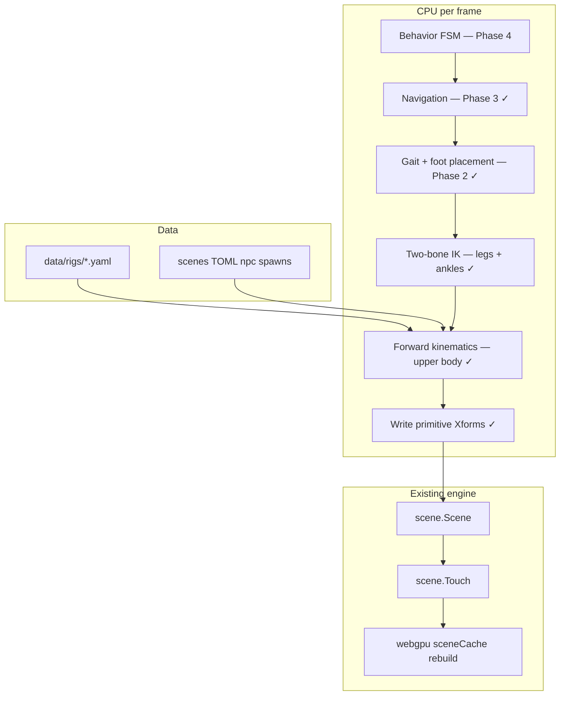
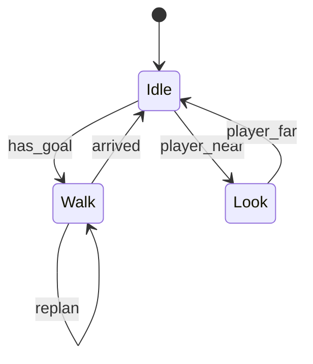

---

name: NPC System
overview: "Layered NPC architecture (rig → locomotion → navigation → behavior). Phases 1–2 are implemented: YAML humanoid rig, FK/IK, TOML spawn, procedural walk on uneven ground with ankles/feet. Phases 3–5 cover navigation, behavior FSM, and GPU performance."
todos:

- id: rig-yaml
content: Add gopkg.in/yaml.v3, data/rigs/humanoid.yaml, and internal/character rig loader + types
status: completed
- id: fk-ik
content: Implement FK pose solver and two-bone IK with unit tests in internal/character
status: completed
- id: dynamic-scene
content: Add scene.NPCSpawn, DynamicBody owned ranges, and attachment primitive spawning
status: completed
- id: sceneio-npc
content: Parse [[npc]] in sceneio, update schemas/scene.schema.json
status: completed
- id: npc-manager
content: Implement internal/npc Manager.Instantiate and wire into app.setScene
status: completed
- id: test-scene
content: Create scenes/npc-test.toml and sceneio integration test
status: completed
- id: p2-gait
content: Gait controller, foot placement, Bezier swing, hip bob, GroundNormal
status: completed
- id: p2-locomotion
content: ComputeLocomotionPose — IK legs, FK upper body, arm swing, Manager.Update
status: completed
- id: p2-feet
content: Ankle joints, foot bones, sole planting, shoe attachments
status: completed
- id: p3-nav
content: Waypoint patrol in TOML, coarse grid A* using static geometry
status: pending
- id: p4-behavior
content: npc.Behavior interface, FSM registry, idle/walk/patrol states
status: pending
- id: p5-perf
content: Partial GPU upload, BVH refit for dynamic primitive ranges
status: completed
isProject: false

---

# NPC System — Architecture and Implementation Plan

## Context

The engine has no general entity layer: the player is `[camera.Camera](internal/camera/camera.go)` walking on `[scene.GroundHeight](internal/scene/physics.go)` / `[Blocked](internal/scene/physics.go)`. Geometry is analytic primitives with per-primitive `[scene.Transform](internal/scene/transform.go)`. Runtime motion follows `[plans/dynamic-objects.md](plans/dynamic-objects.md)`: owned primitive ranges + `[scene.Touch()](internal/scene/scene.go)` → GPU scene-cache rebuild.

NPCs are **multi-bone movers**: limb primitive `Xform`s are rewritten each frame while moving (currently every frame for any agent with `speed > 0`).




---

## Package layout


| Package                                                  | Responsibility                                                                           |
| -------------------------------------------------------- | ---------------------------------------------------------------------------------------- |
| `[internal/character/](internal/character/)`             | YAML rig load, bone tree, FK, IK, gait, locomotion pose, foot planting, attachment spawn |
| `[internal/npc/](internal/npc/)`                         | `Agent`, `Manager`, `FootWorld` (static ground queries excluding own geometry)           |
| `[internal/scene/dynamic.go](internal/scene/dynamic.go)` | `NPCSpawn` metadata + `DynamicBody` owned primitive index ranges                         |
| `[internal/scene/physics.go](internal/scene/physics.go)` | `GroundHeight`, `GroundHeightStatic`, `GroundNormal`, `GroundNormalStatic`               |
| `[internal/sceneio/npc.go](internal/sceneio/npc.go)`     | Parse `[[npc]]` tables                                                                   |
| `[data/rigs/humanoid.yaml](data/rigs/humanoid.yaml)`     | Humanoid rig: bones, attachments, poses, gaits                                           |
| `[scenes/npc-test.toml](scenes/npc-test.toml)`           | Locomotion test scene with stepped platforms                                             |


Dependency: `gopkg.in/yaml.v3`.

---

## Coordinate and heading conventions

**Critical for scene authoring.** Heading matches the camera/player convention in `[internal/camera/camera.go](internal/camera/camera.go)`:


| Heading (°) | World travel direction |
| ----------- | ---------------------- |
| 0           | −Z                     |
| 90          | −X                     |
| 180         | +Z                     |
| 270 (−90)   | **+X**                 |


Implemented in `[internal/character/gait.go](internal/character/gait.go)` as `yawForward(heading)`.

**Rig local space:** character **front is local −Z**. At `heading = 0`, hips get `Ry(0)` (identity), so local −Z maps to world −Z — same as travel direction.

**Left/right on the rig:**

- `thigh_l` hip socket at **+X** local; `thigh_r` at **−X** local.
- Foot lateral offsets use `sideSign`: left = **+1**, right = **−1** (must match hip socket sides; inverting this caused leg-crossing).

**Attachment axes:** bone segments use **+Y** as the bone axis (`NewTransformYAxis`, cylinders along Y). Foot shoe boxes must put their **length along local Y** (toe direction), not Z — putting length on Z made shoes appear backwards even when the bone axis was correct.

**TOML spawn fields:**

```toml
[[npc]]
rig = "data/rigs/humanoid.yaml"
pose = "idle"       # upper-body pose when idle; switches to "walk" when speed > 0
at = [-1.0, 0.0, 0.0]
yaw = 270.0         # visual root yaw (optional if heading set)
speed = 1.2         # m/s; 0 = static
heading = 270.0     # walk direction (°); if omitted, falls back to yaw
```

In `[scenes/npc-test.toml](scenes/npc-test.toml)`, stepped boxes run along **+X** → use `heading = 270`.

---

## Layer 1 — Rig (YAML) ✓

`[data/rigs/humanoid.yaml](data/rigs/humanoid.yaml)` defines:

```yaml
name: humanoid
hip_height: 0.80      # pelvis height above ground contact
ankle_height: 0.06    # sole contact below ankle for IK targeting

bones:
  hips → spine → head
  hips → thigh_l → shin_l → foot_l
  hips → thigh_r → shin_r → foot_r
  spine → upper_arm_l → forearm_l  (mirrored right)

attachments:
  spine/head: box + sphere (torso/head)
  limbs: cylinders
  foot_l/foot_r: box "shoes" (length along bone +Y)

poses:
  idle, walk   # upper-body Euler angles per bone

gaits:
  walk, run    # step_rate, stride, lift, bob
```

**Design choices (validated in practice):**

- Bones: **length + local rest offset**; joints rotate via Euler pitch/yaw/roll (`Rz·Ry·Rx`, same as `[scene.NewRigidTransform](internal/scene/transform.go)`).
- `**hip_height` vs leg bone lengths:** sum of thigh + shin should be slightly **less than** hip-to-ankle reach so two-bone IK has slack for knee bend. Too short → hyper-extended straight legs; too long → legs look disproportionate vs torso.
- **Forearm pitch sign depends on geometry** (shoulder offset, upper-arm roll). Positive pitch bends elbows forward with current rig; regression test in `[internal/character/elbow_dir_test.go](internal/character/elbow_dir_test.go)`.
- **Upper-arm roll:** small **outward** roll (+5° left, −5° right) keeps hands clear of legs; large inward roll caused overlap at the "hands."
- Attachments are Y-up cylinders and axis-aligned boxes in bone-local space; world placement = bone world transform (geometry already offset in local space).
- `LoadRig(path)` returns immutable `*character.Rig`, cached per path in `npc.Manager`.

---

## Layer 2 — Pose and IK ✓

### Forward kinematics (`[internal/character/pose.go](internal/character/pose.go)`)

- Input: rig + pose name + root position/yaw
- Walks bone tree; `ChildAt(jointLocal, pitch, yaw, roll)` composes world transforms
- Root yaw at hips; Y from `GroundHeight` at spawn/update

### Two-bone IK (`[internal/character/ik.go](internal/character/ik.go)`)

- Analytic solver (law of cosines) + pole vector for knee/elbow bend plane
- Leg chain: hip socket → **ankle** (not ground — foot is FK below ankle)
- Limb orientation via `[NewTransformYAxis(origin, tip)](internal/scene/transform.go)` — **column-basis** layout so local +Y maps to bone direction (row-basis bug caused knee gaps)

### Locomotion pose (`[internal/character/locomotion.go](internal/character/locomotion.go)`)

- **Idle / walk:** upper body from FK (`idle` or `walk` pose) + procedural arm swing (cosine phase, opposes leg stride)
- **Legs always IK** when `FootWorld` is available (even at speed 0), so feet plant correctly
- Hip sway/bob: subtle; double-frequency bob was removed (too bouncy)

### Foot / ankle (`[internal/character/foot.go](internal/character/foot.go)`)

- Gait targets **sole contact** on terrain (`Locomotor.Left/Right.World`)
- Ankle = contact + groundNormal × `ankle_height`
- Thigh + shin IK to ankle; foot bone `NewTransformYAxis(ankle, toe)` with toe projected on ground tangent plane
- Shoe box aligned along bone +Y

### Gait (`[internal/character/gait.go](internal/character/gait.go)`)

- `Locomotor`: hip position, phase, per-foot state (planted / stepping)
- Foot targets: lateral offset ±0.14 m, forward offset `cos(phase)·stride/2`
- Step trigger when horizontal drift > `stride × 0.35`; swing via quadratic Bezier with `lift`
- Hip advances along `yawForward(heading) × speed × dt`; bob from `sin(phase)`
- Foot planning uses **hip base Y without bob** so planted feet stay stable

---

## Layer 3 — Scene ownership ✓

`[internal/scene/dynamic.go](internal/scene/dynamic.go)`:

```go
type NPCSpawn struct {
    Rig, Pose string
    Pos       vec.V
    Yaw       float64
    Speed     float64
    Heading   float64  // walk direction; 0 uses Yaw if non-zero
}

type DynamicBody struct {
    Name string
    Boxes, Cylinders, Spheres [2]int  // [start, end) slice ranges
}
```

`[internal/npc/manager.go](internal/npc/manager.go)`:

1. `Instantiate(sc, world)` — spawn attachments, record `DynamicBody` ranges, initial pose, `Touch()`
2. `Update(sc, world, dt)` — advance locomotion, rewrite owned `Xform`s, `Touch()` if changed

**Ground queries:** `[internal/npc/footworld.go](internal/npc/footworld.go)` wraps `GroundHeightStatic` / `GroundNormalStatic` so NPCs never ray-hit their own limb boxes (self-grounding caused Y flicker).

**App loop:** `[internal/app/app.go](internal/app/app.go)` calls `npcs.Update(..., npcDt=1/60)` each frame. Use fixed dt — variable frame delta caused ~6× walk speed at 60 Hz when dt was wrong.

**Collision:** NPCs are visual-only (no player blocking). Capsule blocking deferred.

---

## Layer 4 — TOML spawn ✓

Parsed in `[internal/sceneio/npc.go](internal/sceneio/npc.go)`; schema in `[schemas/scene.schema.json](schemas/scene.schema.json)`.

---

## Test scene ✓

`[scenes/npc-test.toml](scenes/npc-test.toml)`:

- Checker floor + three stepped boxes along **+X** (heights 0.15 / 0.30 / 0.15 m)
- NPC at `[-1, 0, 0]`, `heading = 270` → walks across steps
- Run: `go run . -scene scenes/npc-test.toml`

---

## Tests ✓


| Test                                            | Package   | What it proves                                              |
| ----------------------------------------------- | --------- | ----------------------------------------------------------- |
| `TestLoadHumanoidRig`                           | character | YAML parses; bones, attachments, poses, gaits               |
| `TestFKIdlePose`                                | character | Planted feet, head above hips (via locomotion pose + world) |
| `TestTwoBoneIK`                                 | character | Segment lengths, reach tolerance                            |
| `TestLocomotorUpdate`                           | character | Hip moves along heading forward vector                      |
| `TestLocomotorFeetStayOnCorrectSides`           | character | Left foot stays +X of right at heading 0                    |
| `TestLocomotionKneeBendsDuringStride`           | character | Visible knee flex during walk                               |
| `TestComputeLocomotionPoseIK`                   | character | Thigh/shin meet at knee                                     |
| `TestFootPlantOnGround` / `TestIdleFeetPlanted` | character | Sole near ground, ankle above sole                          |
| `TestForearmPitchBendsForward`                  | character | Elbow bend sign convention                                  |
| `TestHeadingZeroMovesAndFacesNegZ`              | character | Heading 0 → −Z travel and facing                            |
| `TestFootToePointsForward`                      | character | Shoe toe ahead of heel along travel                         |
| `TestNewTransformYAxisMapsLocalY`               | scene     | Bone axis column-basis correctness                          |
| `TestNPCSpawnIntoScene`                         | npc       | Instantiate adds primitives + generation bump               |
| `TestManagerUpdateMovesAgent`                   | npc       | Speed > 0 advances hip each tick                            |


---

## Lessons learned (Phase 1–2)

1. **Self-grounding:** dynamic limb boxes must be excluded from foot raycasts (`GroundHeightStatic`).
2. **Fixed locomotion dt:** `1/60` in app loop, not raw frame time (unless intentionally variable).
3. **Foot lateral sign must match thigh socket side** in the rig (+X = left), in both `initFeet` and `Update`.
4. `**NewTransformYAxis` column basis** — rows caused disconnected knees when legs angled.
5. **IK target is ankle, not sole** — foot bone handles toe/sole orientation.
6. **Shoe attachment length on bone +Y**, not Z — otherwise shoes look reversed while skeleton is correct.
7. **Rig front = local −Z** — matches heading/travel; do not add 180° to root yaw without swapping foot sides.
8. **Arm pitch 168° ≈ hang down** in this Euler order; negative forearm pitch was backward bend until geometry changed — test sign after rig edits.
9. **hip_height vs bone lengths** control both proportion and knee flex; tune together.
10. **Scene authoring:** align `heading` with geometry layout (steps along +X → heading 270).

---

## Phase 2 deliverable ✓

Procedural walk on uneven static terrain with:

- Gait state from speed (idle / walk / run thresholds)
- Alternating foot placement + swing arcs
- Two-bone leg IK with forward knee poles
- Ankle joints + shoe boxes planted on ground normal
- Upper-body walk pose, arm swing, subtle hip/spine sway
- Per-frame GPU re-pack while moving (performance note for Phase 5)

---

## Phase 3 — Navigation ✓

**Goal:** NPC reaches destinations without manual `heading` in TOML; follows paths over static geometry.

**Status:** Implemented — grid A\*, patrol/goal TOML, steering into locomotor.

### Data

```toml
[[npc]]
# ... existing fields ...
patrol = [[-1, 0, 0], [7, 0, 0], [7, 0, 4], [-1, 0, 4]]  # closed loop, XZ waypoints
# or
goal = [7.0, 0.0, 0.0]   # single target
```

Extend `scene.NPCSpawn` + schema; store waypoints on `npc.Agent`.

### Pathfinding

- **Coarse grid A** over static scene geometry only (ignore `DynamicBodies`)
- Cell size ~~0.4 m; mark blocked from `[scene.Blocked](internal/scene/physics.go)` or height delta > step threshold (~~0.35 m)
- Output: polyline in XZ; agent follows segment toward next corner

### Steering → locomotion

- `desiredHeading = atan2(−Δx, −Δz)` in engine convention (same as camera yaw)
- `Locomotor.Heading` lerped each frame (avoid snap turns)
- `Locomotor.Speed` from gait params; stop within ~0.2 m of waypoint
- Advance waypoint index on arrival; loop patrol

### New code


| File                       | Role                                   |
| -------------------------- | -------------------------------------- |
| `internal/npc/nav.go`      | Grid build, A*, waypoint follower      |
| `internal/npc/nav_test.go` | Path around box obstacle in test scene |
| `internal/sceneio/npc.go`  | Parse `patrol` / `goal`                |


### Success criteria

- NPC in npc-test patrols across steps without TOML `heading`
- Stops at last waypoint or loops patrol
- Does not path through static walls/boxes

---

## Phase 4 — Behavior (next)

**Goal:** Per-agent state machines; reusable behaviors beyond constant walking.

### Interface

```go
// internal/npc/behavior.go
type Behavior interface {
    Tick(a *Agent, sc *scene.Scene, world character.FootWorld, dt float64) Behavior
}
```

Registry by name (like `[UseHandlers](internal/app/use.go)`):

```toml
[[npc]]
behavior = "patrol"
behavior_params = { wait_at_waypoint = 1.5 }
```

### Built-in behaviors (first pass)


| Name             | Behavior                                                |
| ---------------- | ------------------------------------------------------- |
| `stand`          | speed 0, idle pose                                      |
| `walk_heading`   | current: fixed heading + speed from TOML                |
| `patrol`         | Phase 3 nav + walk gait                                 |
| `look_at_player` | override root yaw toward camera (upper body only later) |


### FSM sketch




- FSM params in YAML (`data/behaviors/patrol.yaml`) or inline TOML
- Custom Go types register via `npc.RegisterBehavior("guard", NewGuardBehavior)`

### Success criteria

- Two NPCs in one scene: one patrols, one stands idle
- Switching behavior does not leak locomotor state (reset phase on transition)

---

## Phase 5 — Performance ✓

**Goal:** Many moving NPCs without full scene-cache rebuild every frame.

**Status:** Implemented — transform-only invalidation, partial GPU upload, BVH refit.

### Problem today

Any `sc.Touch()` rebuilds GPU buffers for the entire scene (`[internal/webgpu/cache.go](internal/webgpu/cache.go)`). One walking NPC triggers full re-pack each frame.

### Implemented (Phase 5a–5b)

1. **`scene.TouchTransforms()`** — bumps `TransformGeneration` without changing `Generation()`. NPC `Manager.Update` uses this for pose-only edits; `Instantiate` still calls full `Touch()`.
2. **Partial GPU upload** — `sceneCache.updateDynamicTransforms` re-packs only `DynamicBody` primitive ranges, coalesces spans, and `WriteBuffer`s those byte ranges instead of the full prim SSBO.
3. **BVH refit** — `RefitBVH` updates leaf AABBs and refits interior nodes bottom-up (O(nodes)) instead of full SAH rebuild.

### Remaining (future)

- Update cadence — optional lower rate for distant agents (every 2–3 frames)
- Instancing — same rig path → shared topology, per-instance transform buffer

### Milestones


| Step | Target                                                                                | Status |
| ---- | ------------------------------------------------------------------------------------- | ------ |
| 5a   | Dirty flag per `DynamicBody`; skip `Touch()` full rebuild when only transforms change | ✓ `TouchTransforms` + `TransformGeneration` |
| 5b   | Partial GPU buffer write for owned ranges                                             | ✓ `partialPrimSpans` + offset `WriteBuffer` |
| 5c   | 10 agents walking, < 2 ms CPU pose + upload on M-series                               | Benchmark: `BenchmarkManagerUpdate10Agents` |

### Measurement

- Log `sceneCache` rebuild time in debug overlay (already have GPU ms)
- Benchmark `Manager.Update` with N agents in `internal/npc/manager_test.go`

---

## Current humanoid proportions (reference)


| Parameter                | Value                     |
| ------------------------ | ------------------------- |
| hip_height               | 0.80 m                    |
| ankle_height             | 0.06 m                    |
| thigh / shin / foot      | 0.40 / 0.34 / 0.10 m      |
| torso box                | 0.36 × 0.60 × 0.20 m      |
| walk stride / lift / bob | 0.52 m / 0.10 m / 0.018 m |
| walk speed (test)        | 1.2 m/s                   |


Tune in YAML; re-run character tests after proportion changes.

---

## Quick reference — file map

```
data/rigs/humanoid.yaml          Rig definition
internal/character/
  rig.go, pose.go, ik.go         Load, FK, two-bone IK
  gait.go, locomotion.go         Gait + full pose
  foot.go, attach.go             Ankle planting, primitives
internal/npc/
  manager.go, footworld.go       Spawn, update, static ground
internal/scene/dynamic.go        NPCSpawn, DynamicBody
internal/scene/physics.go        Ground* queries
internal/sceneio/npc.go            TOML [[npc]]
scenes/npc-test.toml             Locomotion + steps test
plans/npc_system_phase_1.md      This document
```

**Run test scene:** `go run . -scene scenes/npc-test.toml`

**Run tests:** `go test ./internal/character/... ./internal/npc/...`